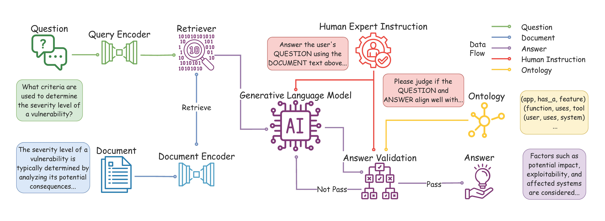

# CyberRAG

[](https://arxiv.org/abs/2412.14191) [](https://github.com/ChengshuaiZhao0/CyberRAG)

This repository contains the official Python implementation of the framework described in the paper **"CyberBOT: Towards Reliable Cybersecurity Education via Ontology-Grounded Retrieval Augmented Generation"**, accepted at CIKM 2025.



## Introduction

Advancements in large language models (LLMs) have enabled the development of intelligent educational tools that support inquiry-based learning across technical domains. In cybersecurity education, where accuracy and safety are paramount, systems must go beyond surface-level relevance to provide information that is both trustworthy and domain-appropriate.

To address this challenge, we introduce **CyberRAG**, a question-answering system that leverages a retrieval-augmented generation (RAG) pipeline to incorporate contextual information from course-specific materials and validate responses using a domain-specific cybersecurity ontology. The ontology serves as a structured reasoning layer that constrains and verifies LLM-generated answers, reducing the risk of misleading or unsafe guidance.

## The CyberRAG Workflow

The CyberRAG framework processes questions through four primary steps:

1.  **Knowledge Base Retrieval**
    The system retrieves relevant context from a knowledge base using the Contriever model. For each question, it computes embeddings and finds the top-k most similar entries in the knowledge base.

2.  **LLM Generation**
    The retrieved context is combined with the question to form a prompt, which is then fed to the Meta-Llama-3-8B-Instruct model to generate an answer.

3.  **Ontology Validation**
    The generated answer is validated against a cybersecurity ontology to ensure it aligns with domain knowledge and maintains consistency with the structured knowledge representation.

4.  **Evaluation**
    The system computes multiple evaluation metrics including BERTScore, METEOR, and ROUGE scores to assess the quality of the generated answers.

## Key Features

-   **Ontology-Aware Validation**: Validates generated answers against a domain-specific cybersecurity ontology to ensure accuracy and domain-appropriateness.
-   **RAG with Knowledge Base**: Incorporates contextual information from course-specific materials through retrieval-augmented generation.
-   **Multi-Metric Evaluation**: Evaluates answer quality using multiple metrics including BERTScore, METEOR, and ROUGE.
-   **Batch Processing Support**: Efficiently processes multiple questions in batches for improved performance.
-   **Highly Configurable**: All paths, models, and hyperparameters are controlled via a centralized configuration file.

## Project Structure

The project is organized into a modular structure for clarity and maintainability:

```
CyberRAG/
├── main.py                   # Main entry point to run experiments
├── config.py                 # Centralized configuration management
├── llm.py                    # Language model loading module
├── answer_retriever.py       # RAG retriever module
├── validation.py             # Ontology validation module
├── utils.py                  # Utility functions (dataset, evaluation)
├── requirements.txt          # Python dependencies
├── dataset/                  # Data directory
│   ├── kb/                   # Knowledge base (CSV format)
│   ├── ontology/             # Ontology files (ontology.txt)
│   └── qa/                   # QA datasets
│       ├── raw/              # Raw QA data (JSON format)
│       └── split/            # Split datasets (CSV format)
└── fig/                      # Figures and visualizations
```

## Setup and Installation

1.  **Clone the Repository**

    ```bash
    git clone https://github.com/ChengshuaiZhao0/CyberRAG.git
    cd CyberRAG
    ```

2.  **Create a Conda Environment (Recommended)**

    ```bash
    conda create -n cyberrag python=3.10
    conda activate cyberrag
    ```

3.  **Install Dependencies**

    ```bash
    pip install -r requirements.txt
    ```

4.  **Model Downloads**

    The system uses HuggingFace models that will be automatically downloaded on first run:
    - Language Model: `meta-llama/Meta-Llama-3-8B-Instruct`
    - Retriever Model: `facebook/contriever`

    Models are cached in the directory specified by `CACHE_DIR` in `config.py`. Ensure you have sufficient disk space and appropriate access permissions.

    **Note**: For the Meta-Llama-3-8B-Instruct model, you may need to request access from Meta and authenticate with HuggingFace.

## Configuration

The system is controlled by a centralized configuration file `config.py`. Key configuration options include:

### Path Configuration

-   `USERNAME`: Your username (modify according to your environment)
-   `BASE_PATH`: Base path for all data and cache directories
-   `CACHE_DIR`: HuggingFace cache directory for downloaded models
-   `QA_KB_PATH`: Path to the knowledge base directory
-   `QUERY_PATH`: Path to the query dataset directory
-   `ONTOLOGY_PATH`: Path to the ontology directory (relative to project root)
-   `SAVE_PATH`: Output directory for results

### Model Configuration

-   `DEFAULT_LLM_MODEL`: Language model to use (default: `meta-llama/Meta-Llama-3-8B-Instruct`)
-   `DEFAULT_RETRIEVER_MODEL`: Retriever model to use (default: `facebook/contriever`)

### Hyperparameters

-   `BATCH_SIZE`: Batch size for RAG generation (default: 16)
-   `REPEAT`: Number of times to repeat the experiment for statistical significance (default: 10)
-   `VALIDATION_BATCH_SIZE`: Batch size for ontology validation (default: 1, recommended)
-   `RETRIEVE_K`: Number of retrieved documents for RAG (default: 1)

### Device Configuration

-   `DEVICE`: Computing device (automatically set to CUDA if available, otherwise CPU)

**Important**: Before running the system, modify `USERNAME` and `BASE_PATH` in `config.py` according to your environment.

## Data Preparation

### Knowledge Base Format

The knowledge base should be a CSV file located in `dataset/kb/` with the following columns:
-   `Question`: The question text
-   `Answer`: The corresponding answer text

Example: `dataset/kb/kb.csv`

### Ontology Format

The ontology file should be a text file located in `dataset/ontology/ontology.txt` containing the structured knowledge representation for the cybersecurity domain.

### QA Dataset Format

Query datasets should be CSV files located in `dataset/qa/split/` with the following columns:
-   `Question`: The question to be answered
-   `Answer`: The ground truth answer

The system will process all CSV files found in the `QUERY_PATH` directory.

## How to Run

To run the experiments, execute the `main.py` script from the root directory:

```bash
python main.py
```

The script will:
1. Load the retrieval model and knowledge base
2. Load the language model
3. Process each query file found in `QUERY_PATH`
4. For each query file:
   - Run multiple repeats (as specified by `REPEAT` in config)
   - Generate predictions using RAG
   - Run ontology validation
   - Save metrics and validation results

**Output**: All results are saved to the directory specified by `SAVE_PATH` in `config.py`:
-   Metrics: `metric_{query_file_name}.npy` - NumPy array containing evaluation metrics
-   Validation results: `validation_{query_file_name}.json` - JSON file containing validation results

**Device Requirements**: The system requires a CUDA-enabled GPU for optimal performance. It will automatically fall back to CPU if CUDA is not available, but this will significantly slow down processing.

## Case Study


## Citation

If you found this repo useful, please feel free to cite our work!

```bibtex
@article{zhao2025cyberbot,
  title={CyberBOT: Towards Reliable Cybersecurity Education via Ontology-Grounded Retrieval Augmented Generation},
  author={Zhao, Chengshuai and De Maria, Riccardo and Kumarage, Tharindu and Chaudhary, Kumar Satvik and Agrawal, Garima and Li, Yiwen and Park, Jongchan and Deng, Yuli and Chen, Ying-Chih and Liu, Huan},
  journal={arXiv preprint arXiv:2504.00389},
  year={2025},
  note={Accepted by CIKM 2025}
}
```
